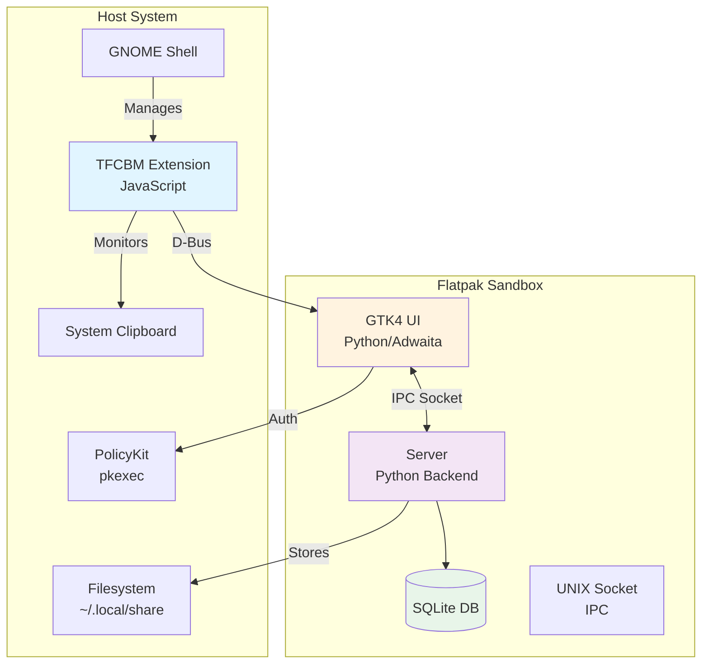
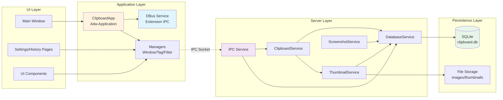
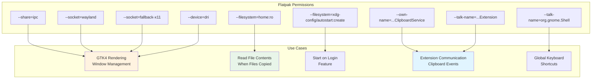
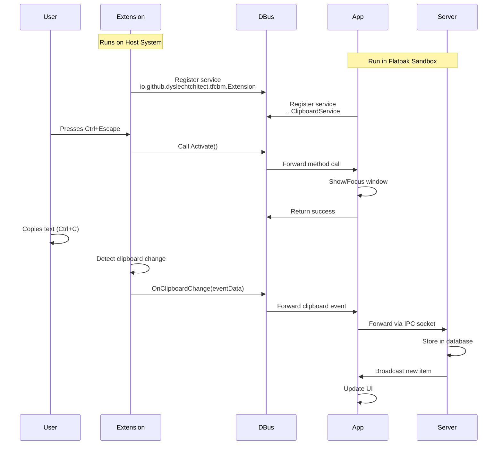
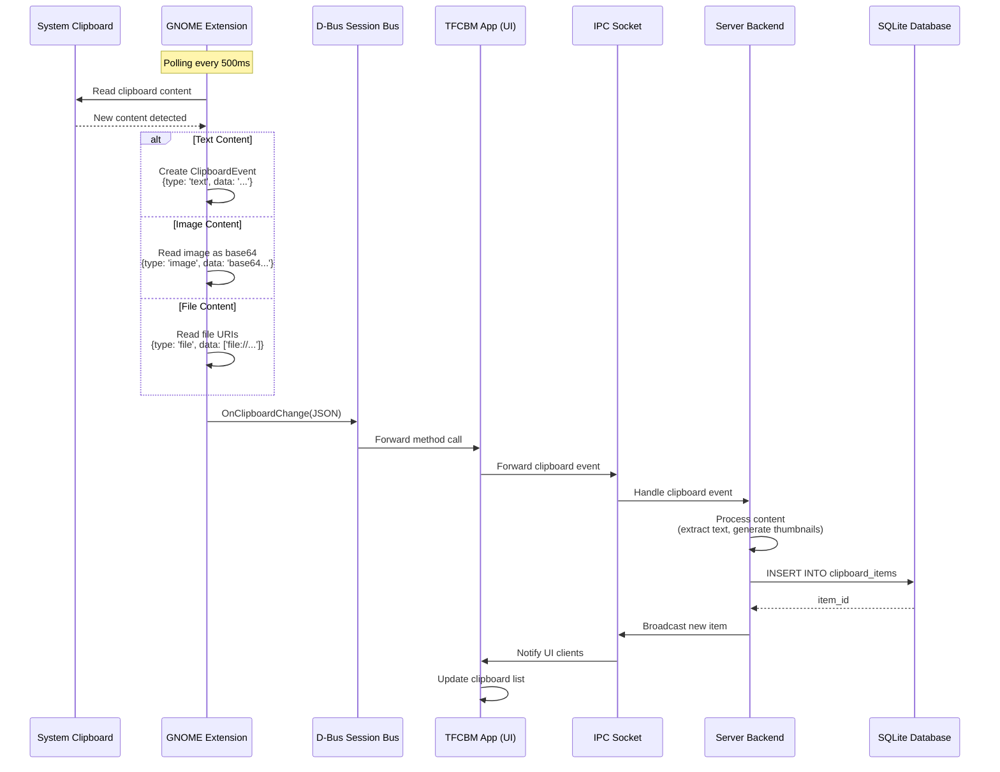
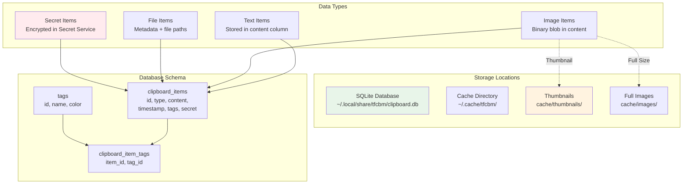
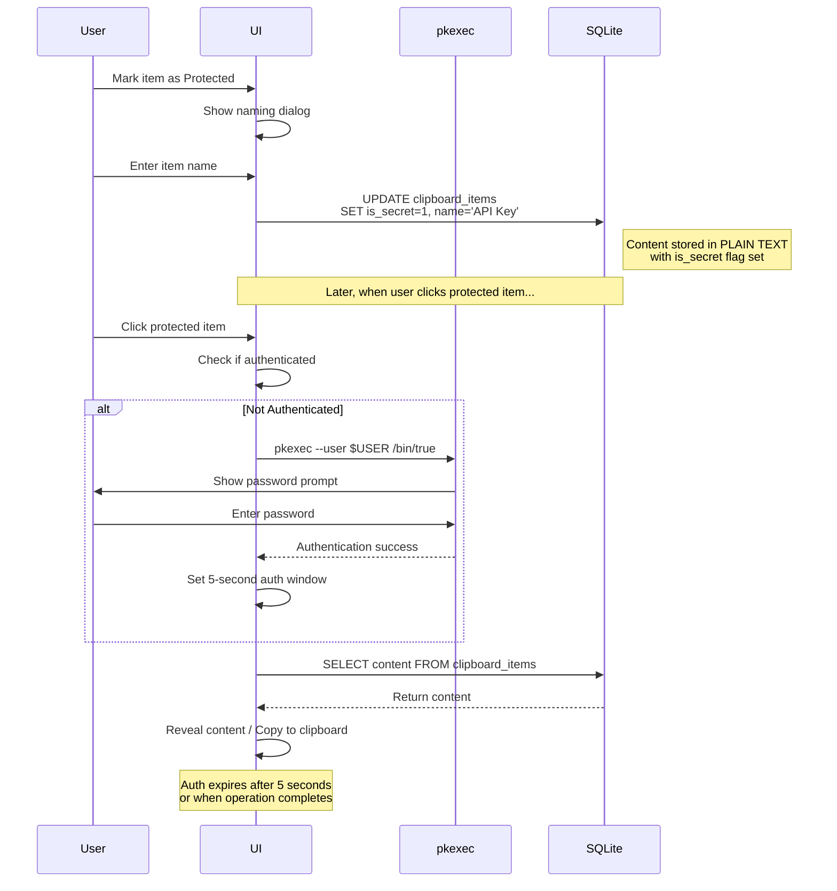
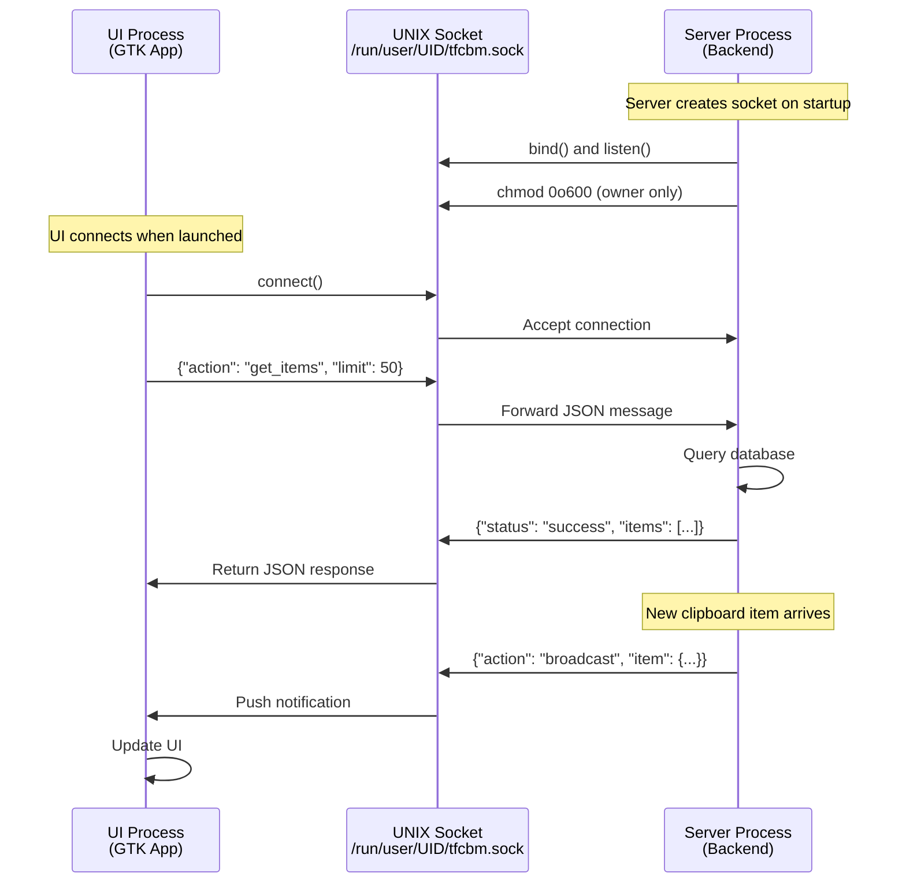

# TFCBM Architecture Documentation

This document provides a holistic understanding of the TFCBM (The F* Clipboard Manager) architecture, including system components, data flows, and Flatpak permissions mapping.

## Table of Contents

1. [System Overview](#system-overview)
2. [Component Architecture](#component-architecture)
3. [Flatpak Permissions & Resource Usage](#flatpak-permissions--resource-usage)
4. [Extension-Application Integration](#extension-application-integration)
5. [Clipboard Monitoring Flow](#clipboard-monitoring-flow)
6. [Data Persistence Architecture](#data-persistence-architecture)
7. [Secret Storage Integration](#secret-storage-integration)
8. [IPC Communication](#ipc-communication)

---

## System Overview

TFCBM is a clipboard manager for GNOME with three main components: a GTK4 application, a backend server, and a GNOME Shell extension.



### Key Characteristics

- **Sandboxed**: Runs inside Flatpak with restricted permissions
- **Split Architecture**: UI and backend server communicate via UNIX socket
- **Extension Integration**: GNOME Shell extension bridges sandbox limitations
- **Secure Storage**: Uses PolicyKit authentication to protect sensitive data

---

## Component Architecture



### Component Responsibilities

| Component | Purpose | Key Technologies |
|-----------|---------|-----------------|
| **ClipboardApp** | Main GTK application, manages windows and lifecycle | GTK4, Adwaita |
| **DBus Service** | Handles extension commands (Activate, ShowSettings, Quit) | GLib D-Bus |
| **IPC Service** | UNIX socket server for UI-Server communication | asyncio, JSON |
| **ClipboardService** | Processes clipboard events, stores items | Python |
| **DatabaseService** | SQLite operations, queries, retention | sqlite3 |
| **ThumbnailService** | Generate thumbnails for images | PIL/Pillow |
| **ScreenshotService** | Optional screenshot capture | gnome-screenshot |

---

## Flatpak Permissions & Resource Usage

This section maps each Flatpak permission to its specific use case in TFCBM.



### Permission Details

#### Display & Rendering
```yaml
--share=ipc                    # Inter-process communication for GTK
--socket=wayland              # Wayland display server (primary)
--socket=fallback-x11         # X11 fallback for older systems
--device=dri                  # Direct Rendering Infrastructure (GPU acceleration)
```
**Usage**: Required for GTK4 applications to render windows and UI elements. Without these, the application cannot display any graphical interface.

#### D-Bus Services
```yaml
--own-name=io.github.dyslechtchitect.tfcbm.ClipboardService
```
**Usage**: Registers a D-Bus service that the GNOME extension calls to send clipboard events. The app owns this bus name to receive `OnClipboardChange()`, `Activate()`, `ShowSettings()`, and `Quit()` method calls.

```yaml
--talk-name=io.github.dyslechtchitect.tfcbm.Extension
```
**Usage**: Allows the Flatpak app to communicate with the host-side GNOME extension. Used to read/write extension settings (keyboard shortcuts) and control extension behavior.

```yaml
--talk-name=org.gnome.Shell
```
**Usage**: Enables the extension to register global keyboard shortcuts with GNOME Shell. Without this, the Ctrl+Escape shortcut wouldn't work.

#### Filesystem Access
```yaml
--filesystem=home:ro
```
**Usage**: Read-only access to home directory. When files are copied to clipboard, TFCBM needs to read file contents to store them. Images and documents are read from their original locations.

⚠️ **Security Note**: Read-only means TFCBM cannot modify, delete, or write files outside its sandbox.

**Note on Protected Items**: TFCBM uses PolicyKit (pkexec) for authentication when accessing protected items. Protected items are stored in SQLite with an `is_secret` flag (naming preserved for backwards compatibility) and their content is hidden in the UI until authenticated. **Content is NOT encrypted** - this is access control, not cryptographic protection.

```yaml
--filesystem=xdg-config/autostart:create
```
**Usage**: Write access to `~/.config/autostart/` to create/remove the autostart desktop file. This enables the "Start on Login" feature in settings.

---

## Extension-Application Integration

The GNOME Shell extension runs on the host system (outside Flatpak) and bridges functionality that's restricted in the sandbox.



### Extension D-Bus Interface

The extension exports these methods on `io.github.dyslechtchitect.tfcbm.Extension`:

| Method | Purpose | Used By |
|--------|---------|---------|
| `GetSetting(schema_id, key)` | Read extension settings (e.g., keyboard shortcut) | App Settings Page |
| `SetSetting(schema_id, key, value)` | Write extension settings | App Settings Page |
| `SimulatePaste()` | Trigger Ctrl+V keypress | Future feature |
| `DisableKeybinding()` | Temporarily disable shortcut | App when window focused |
| `EnableKeybinding()` | Re-enable shortcut | App when window unfocused |

### Application D-Bus Interface

The app exports these methods on `io.github.dyslechtchitect.tfcbm.ClipboardService`:

| Method | Purpose | Called By |
|--------|---------|-----------|
| `Activate(timestamp)` | Bring app window to front | Extension on Ctrl+Escape |
| `ShowSettings(timestamp)` | Open settings page | Extension/external apps |
| `Quit()` | Quit application | Extension/external apps |
| `OnClipboardChange(eventData)` | Receive clipboard events | Extension |

---

## Clipboard Monitoring Flow



### Clipboard Event Types

| Type | Data Format | Processing |
|------|-------------|------------|
| `text` | Plain string | Stored directly, searchable |
| `image` | Base64 PNG | Decoded, thumbnail generated, stored as blob |
| `file` | Array of file:// URIs | File contents read (if accessible), metadata stored |

### Polling Strategy

The extension uses a polling scheduler rather than clipboard event listeners for better reliability:

- **Interval**: 500ms (configurable)
- **Backoff**: After D-Bus errors, waits 500ms before retrying
- **Content Hashing**: Only sends events when clipboard content actually changes

---

## Data Persistence Architecture



### Database Tables

#### `clipboard_items`
```sql
CREATE TABLE clipboard_items (
    id INTEGER PRIMARY KEY AUTOINCREMENT,
    type TEXT NOT NULL,           -- 'text', 'image', 'file'
    content TEXT,                 -- Text content or JSON metadata
    image_data BLOB,              -- Binary image data (PNG)
    timestamp INTEGER NOT NULL,   -- Unix timestamp
    secret INTEGER DEFAULT 0,     -- 0=normal, 1=secret
    secret_name TEXT,             -- Name of secret item
    copied_count INTEGER DEFAULT 0,
    last_copied INTEGER           -- Last time copied to clipboard
);
```

#### `tags`
```sql
CREATE TABLE tags (
    id INTEGER PRIMARY KEY AUTOINCREMENT,
    name TEXT UNIQUE NOT NULL,
    color TEXT                    -- Hex color code
);
```

#### `clipboard_item_tags`
```sql
CREATE TABLE clipboard_item_tags (
    item_id INTEGER,
    tag_id INTEGER,
    PRIMARY KEY (item_id, tag_id),
    FOREIGN KEY (item_id) REFERENCES clipboard_items(id) ON DELETE CASCADE,
    FOREIGN KEY (tag_id) REFERENCES tags(id) ON DELETE CASCADE
);
```

### Retention Policy

- **Default**: Keep last 1000 items
- **Configurable**: Users can change in settings
- **Auto-cleanup**: Runs on startup and periodically
- **Exception**: Secret items are never auto-deleted

---

## Protected Items Feature

TFCBM provides a "Protected Items" feature that uses PolicyKit (pkexec) authentication to control access to sensitive clipboard items. **This is access control, not encryption** - content is stored in plain text but hidden from the UI until the user authenticates.



### Authentication Model

TFCBM uses a **one-time operation model** for protected item access:

1. **Authentication Request**: When user clicks a protected item, pkexec prompts for password
2. **Time Window**: Authentication is valid for 5 seconds and ONE specific operation
3. **Operation-Specific**: Auth is tied to a specific action (view, copy, edit) on a specific item
4. **Auto-Expire**: Authentication clears after operation completes or timeout

### Security Properties

- **System Authentication**: Uses OS-level PolicyKit, same as system settings
- **Time-Limited**: 5-second window prevents prolonged access
- **Operation-Specific**: Can't reuse auth for different operations or items
- **Plain Text Storage**: Protected items stored in SQLite in **plain text** with `is_secret=1` flag
- **UI Protection**: Content hidden in UI until authenticated
- **No Encryption**: ⚠️ **Content is NOT encrypted** - this provides UI-level access control only
- **Security Limitation**: Anyone with filesystem access can read the SQLite database

### Protected Item Lifecycle

| Action | Authentication Required | Effect |
|--------|------------------------|---------|
| Mark as Protected | No | Sets `is_secret=1` in database (plain text) |
| View Content | Yes | Shows hidden content temporarily |
| Copy to Clipboard | Yes | Copies content after auth |
| Edit/Delete | Yes | Allows modification after auth |
| Unmark as Protected | Yes | Shows confirmation dialog, removes flag |
| Direct DB Access | N/A | ⚠️ Content readable by anyone with file access |

### Important Security Notice

**Protected Items are NOT encrypted.** They are stored in plain text in `~/.local/share/tfcbm/clipboard.db`. The protection is only at the UI level - it prevents casual viewing but does not protect against:

- Direct database access
- Filesystem-level access
- Backups containing the database
- Other applications with file read permissions

For truly sensitive data requiring encryption, consider using a dedicated password manager with end-to-end encryption.

---

## IPC Communication

The UI and server processes communicate via a UNIX domain socket using a JSON-based protocol.



### IPC Message Types

#### Client → Server

| Action | Parameters | Response |
|--------|------------|----------|
| `get_items` | `limit`, `offset`, `search`, `tag_filter` | List of items |
| `get_item` | `item_id` | Single item with full content |
| `delete_item` | `item_id` | Success/error |
| `update_tags` | `item_id`, `tags` | Success/error |
| `copy_to_clipboard` | `item_id` | Success/error |
| `get_settings` | None | Settings object |
| `update_settings` | `settings` | Success/error |

#### Server → Client (Broadcasts)

| Event | Data | Purpose |
|-------|------|---------|
| `new_item` | `item` object | Notify UI of new clipboard item |
| `item_deleted` | `item_id` | Update UI when item removed |
| `settings_changed` | `settings` | Sync settings across windows |

### Protocol Format

```json
{
    "action": "get_items",
    "params": {
        "limit": 50,
        "offset": 0,
        "search": "example",
        "tag_filter": ["work", "important"]
    }
}
```

Response:
```json
{
    "status": "success",
    "data": {
        "items": [...],
        "total_count": 1234
    }
}
```

Error:
```json
{
    "status": "error",
    "error": "Item not found",
    "code": "ITEM_NOT_FOUND"
}
```

---

## Summary

TFCBM's architecture balances functionality with security through:

1. **Sandboxing**: Flatpak isolation limits potential damage
2. **Extension Bridge**: GNOME Shell extension provides host system access
3. **Split Architecture**: Separate UI and backend for better resource management
4. **Access Control**: PolicyKit authentication for sensitive clipboard items
5. **Efficient IPC**: UNIX sockets for fast UI-server communication
6. **Minimal Permissions**: Each permission has a specific, documented purpose

This architecture ensures clipboard management is both powerful and secure, respecting user privacy while providing a seamless experience.
