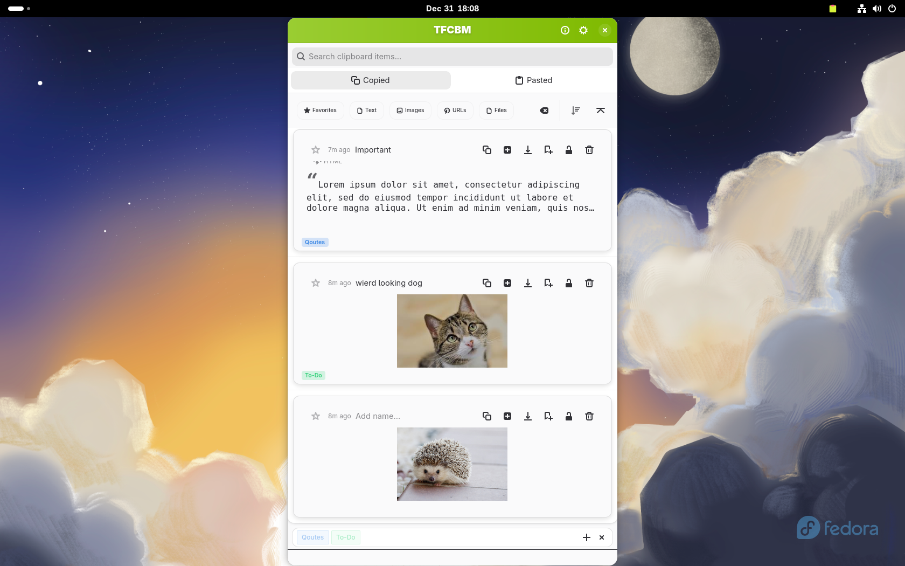
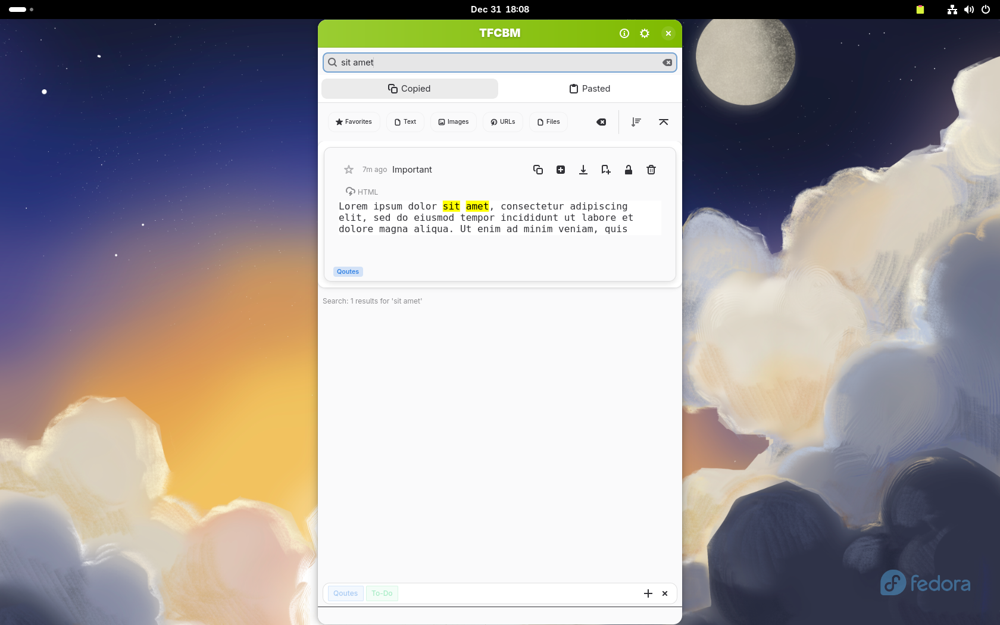

# TFCBM

<p align="center">
  
</p>

<p align="center">
  <a href="LICENSE"></a>
  <a href="https://flathub.org/apps/io.github.dyslechtchitect.tfcbm"></a>
</p>

A clipboard manager for Linux. Keeps a searchable history of everything you copy.

```bash
flatpak install flathub io.github.dyslechtchitect.tfcbm
```

## Features

- Clipboard history for text, images, and files
- Search and filter
- Tags and organization
- Configurable keyboard shortcut
- Retention management

## Usage

Press `Ctrl+Escape` (configurable) to open. Click an item or press Enter to copy it back to the clipboard.

## Build from Source

```bash
flatpak install flathub org.gnome.Platform//49 org.gnome.Sdk//49
git clone https://github.com/dyslechtchitect/tfcbm.git
cd tfcbm
flatpak-builder --user --install --force-clean build-dir io.github.dyslechtchitect.tfcbm.yml
```
## Install

<a href="https://flathub.org/apps/io.github.dyslechtchitect.tfcbm">
  
</a>

## Screenshots

<p align="center">
  
</p>

<p align="center">
  
</p>

<p align="center">
  
</p>


## License

[GPL-3.0-or-later](LICENSE)
