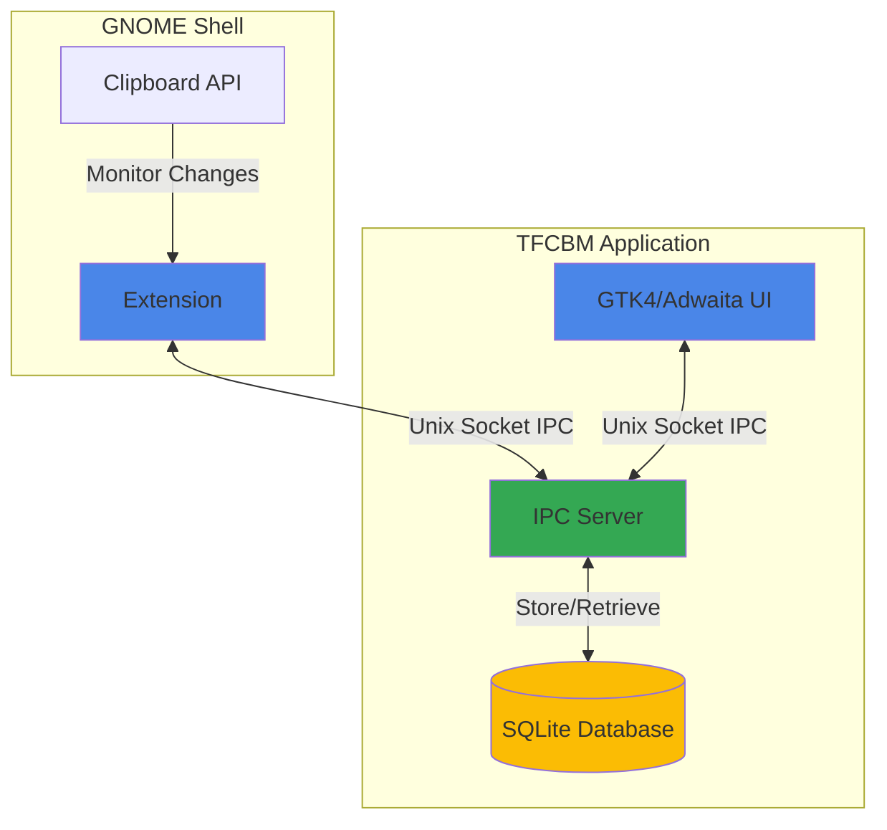
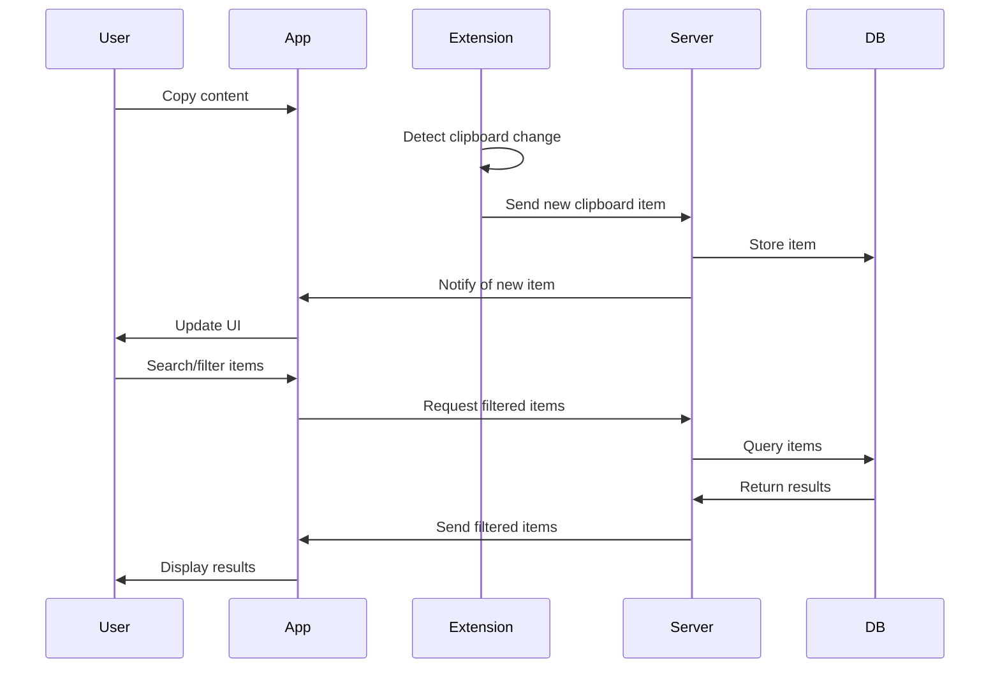

<h1 align="center">
  <strong>TFCBM - The * Clipboard Manager</strong>
</h1>

<p align="center">
  
</p>

<p align="center">
  <strong>A powerful, lightweight clipboard manager for GNOME</strong>
</p>

<p align="center">
  <a href="LICENSE"></a>
  
  
  <a href="https://github.com/dyslechtchitect/tfcbm/actions/workflows/flatpak-ci.yml"></a>
</p>

## About

TFCBM is a modern clipboard manager designed to enhance your GNOME desktop experience. It keeps track of everything you copy, making it easy to find and reuse content from your clipboard history. Whether you're a developer, writer, or power user, TFCBM helps you work more efficiently by never losing track of your copied content.

The application seamlessly integrates with your GNOME desktop through a shell extension, providing quick access via a keyboard shortcut or system tray icon. With support for text, images, files, and more, TFCBM handles all your clipboard needs in one place.

## Features

- **Complete Clipboard History** - Never lose copied content again
- **Powerful Search** - Find anything in your clipboard history instantly
- **Tags & Organization** - Organize clips with custom tags and colors
- **Rich Media Support** - Images, files, URLs, and formatted text
- **Secret Management** - Mark sensitive items as secrets with password protection
- **Keyboard Navigation** - Fast workflow with keyboard shortcuts
- **Modern UI** - Beautiful Adwaita-based interface
- **Real-time Sync** - Instant clipboard monitoring via GNOME extension
- **Persistent Storage** - SQLite database with automatic retention management

## Architecture

TFCBM is built with a clean, modular architecture that separates concerns and enables reliable clipboard management:


```mermaid
graph TB
    subgraph "GNOME Shell"
        EXT[Extension]
        CLIP[Clipboard API]
    end

    subgraph "TFCBM Application"
        UI[GTK4/Adwaita UI]
        SERVER[IPC Server]
        DB[(SQLite Database)]
    end

    CLIP -->|Monitor Changes| EXT
    EXT <-->|Unix Socket IPC| SERVER
    UI <-->|Unix Socket IPC| SERVER
    SERVER <-->|Store/Retrieve| DB

    style EXT fill:#4a86e8
    style UI fill:#4a86e8
    style SERVER fill:#34a853
    style DB fill:#fbbc04
```

### Components

**GNOME Shell Extension**
- Monitors clipboard changes in real-time using GNOME's Clipboard API
- Provides system tray integration with quick access menu
- Communicates with the backend server via Unix domain sockets

**Backend Server**
- IPC server using Unix domain sockets for fast, reliable communication
- Manages SQLite database for persistent clipboard storage
- Handles clipboard operations (search, tag, delete, etc.)
- Implements retention policies and secret content protection

**UI Application**
- GTK4/Adwaita interface following GNOME HIG guidelines
- Displays clipboard history with search and filtering
- Tag management and organization features
- Settings and configuration interface

### Data Flow


```mermaid
sequenceDiagram
    participant User
    participant App
    participant Extension
    participant Server
    participant DB

    User->>App: Copy content
    Extension->>Extension: Detect clipboard change
    Extension->>Server: Send new clipboard item
    Server->>DB: Store item
    Server->>App: Notify of new item
    App->>User: Update UI

    User->>App: Search/filter items
    App->>Server: Request filtered items
    Server->>DB: Query items
    DB->>Server: Return results
    Server->>App: Send filtered items
    App->>User: Display results
```

## Installation

### From Flathub (Recommended)

```bash
flatpak install flathub io.github.dyslechtchitect.tfcbm
```

### From Source

1. Install dependencies:
   ```bash
   sudo dnf install flatpak-builder  # Fedora
   sudo apt install flatpak-builder  # Ubuntu/Debian
   ```

2. Install Flatpak runtime:
   ```bash
   flatpak install flathub org.gnome.Platform//49 org.gnome.Sdk//49
   ```

3. Build and install:
   ```bash
   git clone https://github.com/dyslechtchitect/tfcbm.git
   cd tfcbm
   flatpak-builder --user --install --force-clean build-dir io.github.dyslechtchitect.tfcbm.yml
   ```

4. Run:
   ```bash
   flatpak run io.github.dyslechtchitect.tfcbm
   ```

## Usage

### First Run

On first launch, TFCBM will install and enable the GNOME Shell extension for clipboard monitoring.

The extension provides:
- System tray icon for quick access
- Real-time clipboard monitoring
- Global keyboard shortcut (default: `Ctrl+Escape`, configurable in settings)

### Keyboard Shortcuts

| Shortcut | Action |
|----------|--------|
| `Ctrl+Escape` | Toggle TFCBM window (configurable) |
| `Ctrl+F` | Focus search |
| `Enter` | Paste selected item and close |
| `Shift+Enter` | Paste selected item (keep window open) |
| `Delete` | Delete selected item |
| `↑/↓` | Navigate clipboard history |
| `Esc` | Close window |

### Tray Icon Menu

- **TFCBM Settings**: Open settings page
- **Quit TFCBM App**: Quit application and disable extension

## Development

### Prerequisites

- Python 3.11+
- GNOME 47-49 (GNOME 45-46 are EOL as of April 2025)
- Flatpak SDK (for packaging)

### Setup

```bash
python3 -m venv .venv
source .venv/bin/activate
pip install -r requirements.txt

# Run server
python3 main.py

# Run UI (in another terminal)
python3 ui/main.py
```

### Testing

```bash
# Server tests
cd server
../.venv/bin/pytest test/integration -v

# Extension tests
cd gnome-extension
npm test
```

### CI/CD

The project uses GitHub Actions for continuous integration:
- Tests run on every push and PR
- Flatpak builds tested against GNOME 47-49
- Artifacts uploaded for each GNOME version

## Configuration

- Clipboard database: `~/.local/share/tfcbm/clipboard.db`
- Extension settings: `dconf /org/gnome/shell/extensions/tfcbm-clipboard-monitor/`

## Uninstalling

1. Click "Quit TFCBM App" from the tray icon
2. Uninstall from GNOME Software

Or via command line:
```bash
flatpak uninstall io.github.dyslechtchitect.tfcbm
gnome-extensions uninstall tfcbm-clipboard-monitor@github.com
```

## Contributing

Contributions are welcome! Please:

1. Fork the repository
2. Create a feature branch
3. Make your changes with clear commit messages
4. Add tests for new functionality
5. Submit a pull request

## License

TFCBM is licensed under the GNU General Public License v3.0 or later.
See [LICENSE](LICENSE) for details.

## Support

- **Issues**: [GitHub Issues](https://github.com/dyslechtchitect/tfcbm/issues)
- **Discussions**: [GitHub Discussions](https://github.com/dyslechtchitect/tfcbm/discussions)

---

<p align="center">Made with ❤️ for the GNOME community</p>
