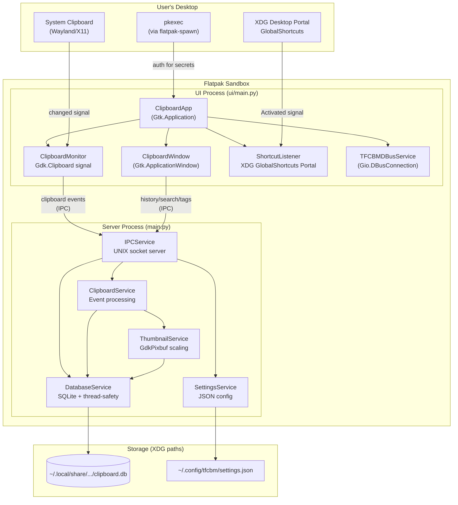
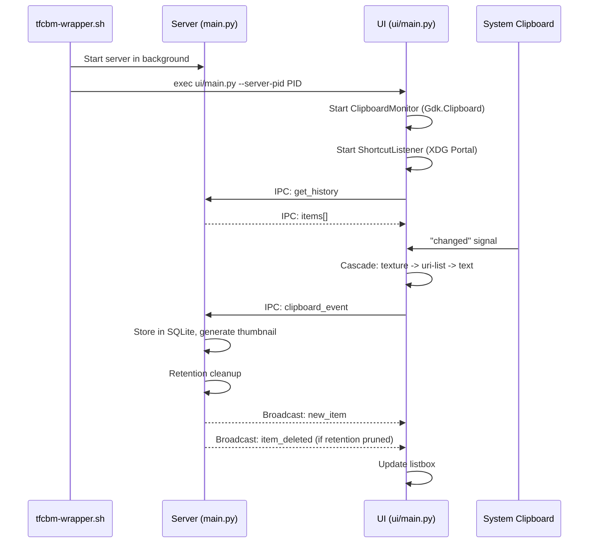
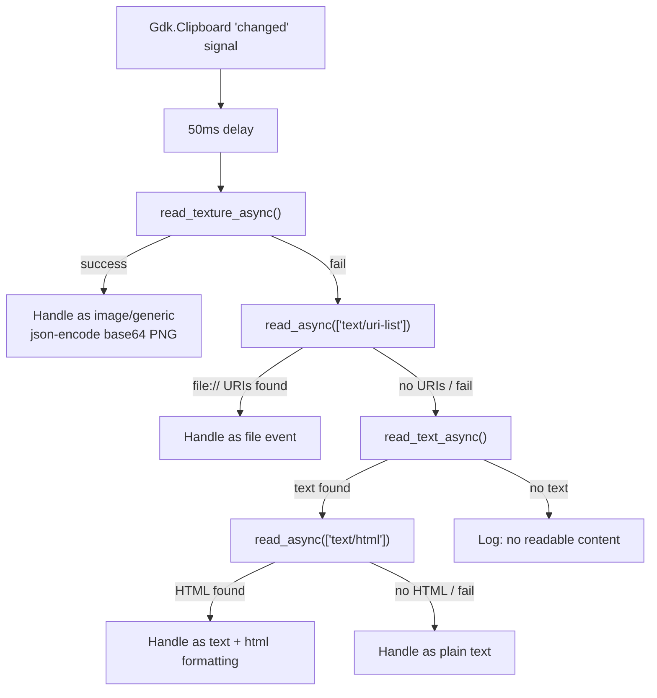

# TFCBM Architecture & Dependencies

## High-Level Architecture



## Process Model



## Clipboard Detection Cascade



## Runtime Dependencies

### What the app actually imports (from code, not docs)

| GI Module | Version | Where Used | Purpose |
|-----------|---------|------------|---------|
| **Gtk** | 4.0 | 41 files | UI framework |
| **Gdk** | 4.0 | 11 files | Clipboard, display, keyboard, DnD |
| **GLib** | 2.0 | Everywhere (via Gio/Gtk) | Event loop, variants, idle_add |
| **Gio** | 2.0 | 8 files | D-Bus, file I/O, actions |
| **GObject** | 2.0 | 3 files | Signal handling, type system |
| **GdkPixbuf** | 2.0 | 5 files | Image loading, thumbnails |
| **Pango** | 1.0 | 2 files | Text layout/measurement |
| **WebKit** | 6.0 | 1 file (optional) | HTML preview in view dialog |

### Python stdlib (no pip install needed)

asyncio, base64, concurrent.futures, dataclasses, datetime, hashlib, json,
logging, mimetypes, os, pathlib, re, shutil, signal, sqlite3, subprocess,
sys, threading, time, traceback, typing, urllib.parse

### Pip packages

| Package | Status | Notes |
|---------|--------|-------|
| **PyGObject>=3.42.0** | REQUIRED | Python bindings for all GI modules |
| **pytest>=8.4.2** | DEV ONLY | Not needed at runtime |

### System tools

| Tool | Usage | Notes |
|------|-------|-------|
| **xdotool** | Auto-paste after copy | Commented as system dep in requirements.txt |
| **pkexec** | Secret item authentication | Via flatpak-spawn --host in sandbox |

## Dead Code & Unused Dependencies (Mark for Deletion)

### Files to delete

| File | Reason |
|------|--------|
| `ui/utils/extension_check.py` | GNOME extension check utility. Only imported by `gsettings_store.py` which is itself dead. 502 lines of dead code. |
| `ui/infrastructure/gsettings_store.py` | `GSettingsStore` and `ExtensionSettingsStore` classes. ZERO imports anywhere in the codebase. Replaced by `JsonSettingsStore`. 630 lines of dead code. |
| `ui/managers/window_manager.py` | `WindowManager` class. Exported from `__init__.py` but never instantiated anywhere. 26 lines. |
| `ui/windows/extension_error_window.py` | Already deleted in git (shows as `D` in status). Confirm removal. |

### Dead imports within live files

| File | Line | Import | Reason |
|------|------|--------|--------|
| `ui/main.py` | 17 | `import signal` | Never referenced |
| `ui/managers/keyboard_shortcut_handler.py` | 4 | `import shutil` | Never referenced |
| `ui/rows/handlers/clipboard_operations_handler.py` | 14 | `import shutil` | Never referenced |

### Dead `__init__.py` exports

| File | Export | Reason |
|------|--------|--------|
| `ui/managers/__init__.py` | `WindowManager` in `__all__` | Class is never used; remove from `__all__` and `from .window_manager import` line |

## GNOME vs Freedesktop Runtime

### Current: `org.gnome.Platform//49`

Provides everything out of the box: GTK4, GdkPixbuf, Pango, GLib, Gio,
WebKit, Adwaita theme, python3 + PyGObject.

### Alternative: `org.freedesktop.Platform//24.08`

`org.freedesktop.Platform` does NOT include GTK4, GdkPixbuf, Pango, or
WebKit. Switching would require bundling all of them as Flatpak modules.

**What you'd need to add to the manifest:**

```yaml
modules:
  # ~50 MB of extra bundled libraries:
  - name: gtk4           # + its deps: graphene, gdk-pixbuf, pango,
                         #   harfbuzz, fribidi, cairo, glib, etc.
  - name: pygobject      # Python bindings
  - name: libadwaita     # If you want Adwaita styling (optional)
  - name: webkit2gtk-6.0 # Only if you keep HTML preview (optional)
```

**Verdict: Stay on `org.gnome.Platform`.** It is the standard runtime for
GTK4 apps regardless of target DE. KDE ships GTK4 apps (like GIMP,
Inkscape) using GNOME Platform without issues. Freedesktop Platform would
triple the build complexity for zero user-visible benefit.

The app is already DE-agnostic in code (Gdk.Clipboard, XDG Portal
shortcuts, CSD headers). The runtime choice doesn't affect DE compatibility.

## Manifest Recommendations

### Current issues

1. **`Categories=Utility;GNOME;GTK;`** in desktop file -- remove `GNOME`
   since app is DE-agnostic. Use `Categories=Utility;GTK;`

2. **`X-GNOME-UsesNotifications=true`** in desktop file -- GNOME-specific
   key. Harmless on KDE but unnecessary.

3. **`resouces`** typo in meson.build line 25 -- directory is actually
   named `resouces` (missing 'r'). Either rename the directory to
   `resources` or leave as-is (functional but ugly).

4. **Missing `--talk-name=org.freedesktop.portal.Desktop`** in manifest --
   the ShortcutListener uses the XDG GlobalShortcuts portal. Portal access
   works by default for Flatpak apps, but explicitly listing it is good
   practice.

## Meson Build Refresh

The meson.build is mostly correct. Suggested changes:

1. **Remove `gnome-extension/` from install** -- it's not referenced in
   meson.build (good), but the directory ships with the source. Consider
   adding it to the Flatpak manifest's `sources` exclude, or just leave it
   (meson ignores it).

2. **The `install_subdir` for `ui/`** installs everything including dead
   files like `gsettings_store.py` and `extension_check.py`. After deleting
   those files, no meson changes needed.

3. **No sub-meson.build files exist** -- the single root meson.build handles
   everything. This is fine for the project's size.

## Summary of Actionable Items

### Delete (dead code)
- [ ] `ui/utils/extension_check.py`
- [ ] `ui/infrastructure/gsettings_store.py`
- [ ] `ui/managers/window_manager.py`
- [ ] `WindowManager` export from `ui/managers/__init__.py`

### Clean up (dead imports)
- [ ] `ui/main.py:17` -- remove `import signal`
- [ ] `ui/managers/keyboard_shortcut_handler.py:4` -- remove `import shutil`
- [ ] `ui/rows/handlers/clipboard_operations_handler.py:14` -- remove `import shutil`

### Desktop file
- [ ] Change `Categories=Utility;GNOME;GTK;` to `Categories=Utility;GTK;`
- [ ] Optionally remove `X-GNOME-UsesNotifications=true`

### Keep as-is
- Flatpak runtime: `org.gnome.Platform//49` (correct choice)
- Meson build: functional, no structural changes needed
- `requirements.txt`: accurate, no unused pip deps
