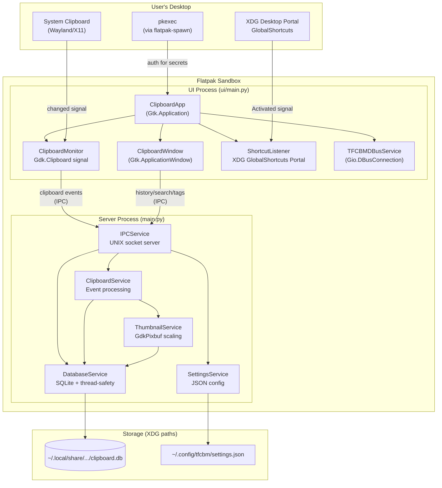
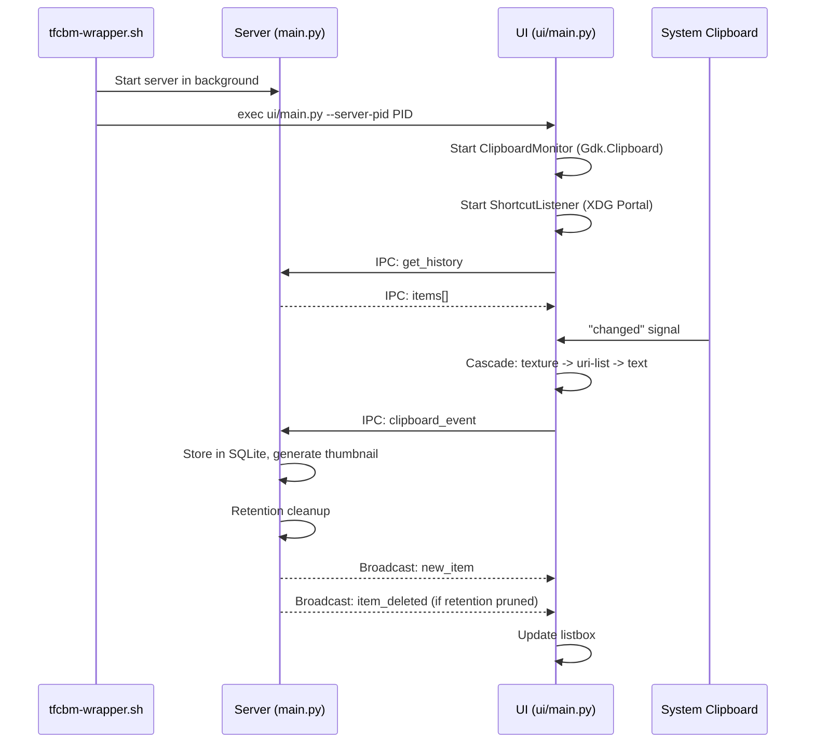
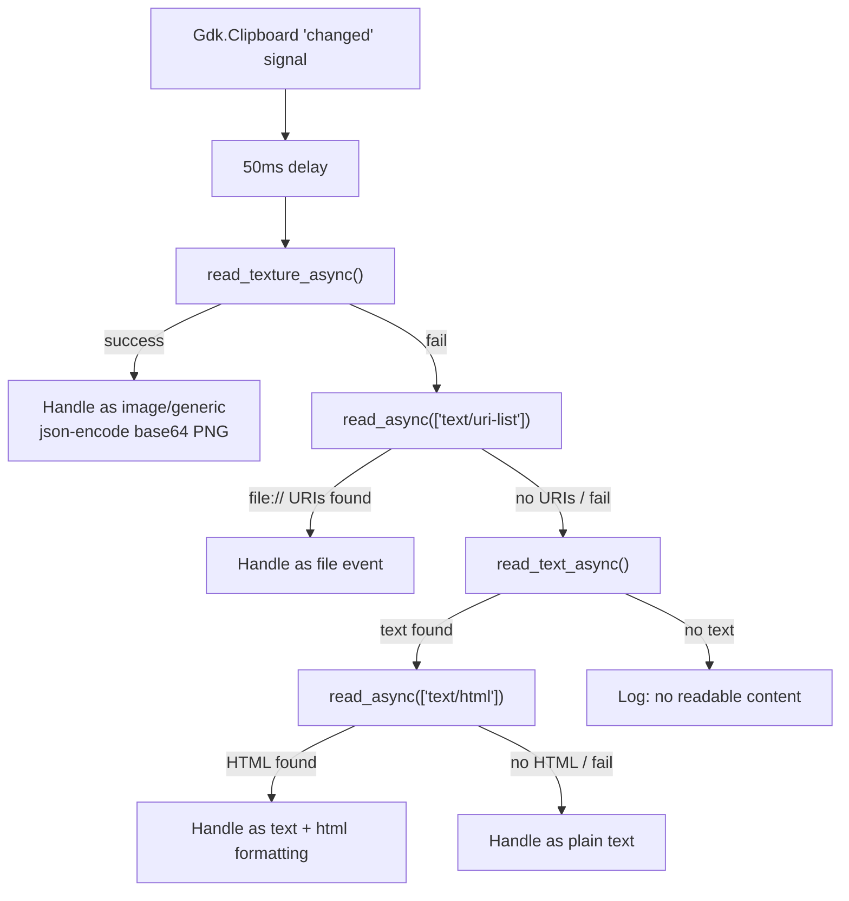

# TFCBM Architecture & Dependencies

## High-Level Architecture

TFCBM is a two-process clipboard manager distributed as a Flatpak.
The **server** manages persistence and event processing; the **UI** handles
clipboard monitoring, user interaction, and global shortcuts.

## Process Model

## Clipboard Detection Cascade

The `ClipboardMonitor` tries each read method and cascades on failure.
This avoids `get_formats().contain_mime_type()` which returns `False` for
everything on KDE Wayland.

## Runtime Dependencies

### GI Modules (provided by org.gnome.Platform runtime)

| GI Module | Version | Where Used | Purpose |
|-----------|---------|------------|---------|
| **Gtk** | 4.0 | UI framework | Windows, widgets, list rows |
| **Gdk** | 4.0 | ClipboardMonitor, display, DnD | Clipboard access, keyboard |
| **GLib** | 2.0 | Everywhere | Event loop, idle_add, variants |
| **Gio** | 2.0 | DBus, IPC, file I/O | D-Bus service, portal calls |
| **GObject** | 2.0 | Signal handling | Type system |
| **GdkPixbuf** | 2.0 | ThumbnailService | Image loading & scaling |
| **Pango** | 1.0 | Text layout | Measurement & rendering |
| **WebKit** | 6.0 | HTML preview (optional) | Rich text preview in view dialog |

### Python stdlib (no pip install needed)

asyncio, base64, concurrent.futures, dataclasses, datetime, hashlib, json,
logging, mimetypes, os, pathlib, re, shutil, signal, sqlite3, subprocess,
sys, threading, time, traceback, typing, urllib.parse

### Pip packages

| Package | Status | Notes |
|---------|--------|-------|
| **PyGObject>=3.42.0** | REQUIRED | Python bindings for all GI modules |
| **pytest>=8.4.2** | DEV ONLY | Not needed at runtime |

### System tools

| Tool | Usage | Notes |
|------|-------|-------|
| **xdotool** | Auto-paste after copy | System dep |
| **pkexec** | Protected item authentication | Via `flatpak-spawn --host` |

## Flatpak Runtime

**Runtime:** `org.gnome.Platform//49`

This is the standard runtime for GTK4 apps regardless of target DE. KDE ships
GTK4 apps (GIMP, Inkscape, etc.) using GNOME Platform without issues.
`org.freedesktop.Platform` does NOT include GTK4, GdkPixbuf, Pango, or WebKit
and would require bundling all of them as Flatpak modules for zero user-visible
benefit.

The app is DE-agnostic in code: Gdk.Clipboard for monitoring, XDG Portal for
shortcuts, CSD headers via `set_titlebar()`, JSON settings. The runtime choice
does not affect DE compatibility.

## D-Bus Interface

The UI process owns `io.github.dyslechtchitect.tfcbm.ClipboardService` on the
session bus, exposing:

| Method | Purpose | Called By |
|--------|---------|-----------|
| `Activate(timestamp)` | Toggle window visibility | ShortcutListener |
| `ShowSettings(timestamp)` | Open settings page | External callers |
| `Quit()` | Quit application | External callers |

## IPC Protocol

UI and server communicate via a UNIX domain socket at
`$XDG_RUNTIME_DIR/tfcbm.sock` using length-prefixed JSON messages.

### Client -> Server

| Action | Key Parameters |
|--------|---------------|
| `get_history` | `offset`, `limit`, `sort_order`, `filters` |
| `get_recently_pasted` | `offset`, `limit`, `sort_order`, `filters` |
| `search` | `query`, `limit`, `filters` |
| `clipboard_event` | `data` (type, content, formatted_content) |
| `delete_item` | `id` |
| `update_tags` | `item_id`, `tags` |
| `toggle_favorite` | `id` |
| `toggle_secret` | `id` |
| `get_settings` | -- |
| `update_settings` | settings dict |

### Server -> Client (broadcasts)

| Event | Data | Purpose |
|-------|------|---------|
| `new_item` | item object | New clipboard entry |
| `item_deleted` | `id` | Item removed (manual or retention) |
| `settings_changed` | settings | Sync across clients |
