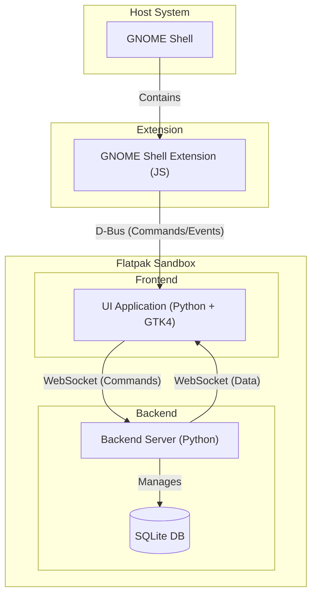
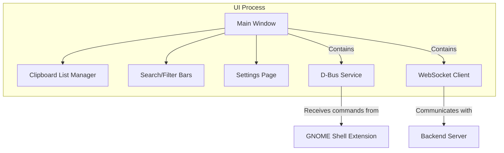
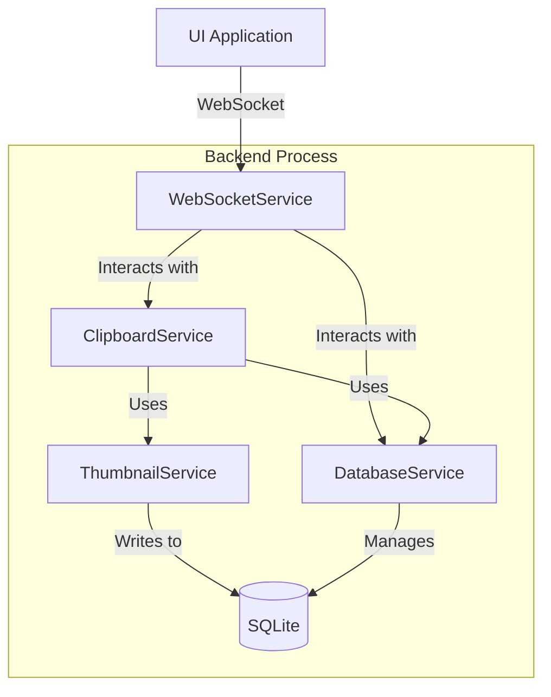
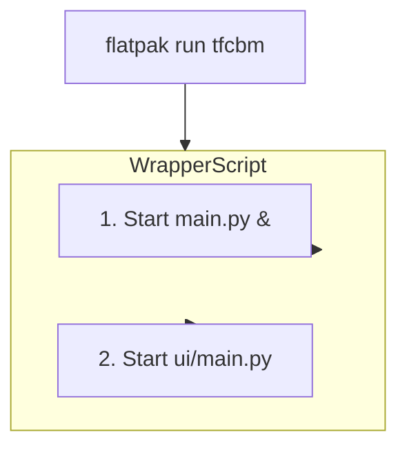

# TFCBM Architecture

This document provides a top-to-bottom overview of the TFCBM (Tinfoil Clipboard Manager) architecture, from the high-level components down to the backend services and deployment model.

## 1. High-Level Overview

TFCBM is architected as a multi-component system designed to run on a modern GNOME desktop, with a clear separation of concerns between clipboard monitoring, data persistence, and user interface.

The four primary components are:
1.  **GNOME Shell Extension**: A lightweight JavaScript extension that monitors the system clipboard and provides a system tray icon.
2.  **UI Application**: A GTK4 application written in Python that serves as the user-facing interface for viewing and managing clipboard history.
3.  **Backend Server**: A Python process that manages the application's core logic, including the database and communication between other components.
4.  **Database**: An SQLite database for persisting all clipboard data.

These components communicate primarily through two channels: **D-Bus** for direct commands and events between the extension and the UI, and **WebSockets** for data streaming from the backend server to the UI.

### Data Flow: New Clipboard Item
1.  User copies text or an image.
2.  The **GNOME Shell Extension** detects the change using a polling mechanism.
3.  The Extension calls the `OnClipboardChange` method on the application's **D-Bus** interface.
4.  The **UI Application** receives the D-Bus call and sends the new clipboard data to the **Backend Server** via a **WebSocket** message.
5.  The **Backend Server** processes the data (e.g., generating thumbnails) and saves it to the **SQLite Database**.
6.  The Backend Server then broadcasts the new, saved item to all connected UI clients (typically just one) via WebSocket, ensuring the UI is always in sync with the database state.

## 2. Component Breakdown

### UI Application (GTK4)
-   **Location**: `ui/`
-   **Description**: The main window of the application, written in Python using PyGObject and GTK4. It is responsible for displaying the clipboard history, handling user input (searching, filtering, tagging), and managing the settings page.
-   **Communication**: It initiates a WebSocket connection to the Backend Server to receive clipboard history and real-time updates. It also exposes a D-Bus service that the GNOME Shell Extension uses to control it (e.g., show/hide window, quit).

### Backend Server
-   **Location**: `main.py`, `server/`
-   **Description**: A headless Python process that runs in the background. It is the central hub of the application, responsible for managing the database, handling business logic, and serving data to the UI via WebSockets.
-   **Key Services**:
    -   `WebSocketService`: Manages WebSocket connections and message passing with the UI.
    -   `DatabaseService`: Provides an abstraction layer for all database operations (CRUD).
    -   `ClipboardService`: Handles the logic for processing new clipboard items.
    -   `ThumbnailService`: Generates thumbnails for image-based clipboard items in a separate thread.

### GNOME Shell Extension
-   **Location**: `gnome-extension/`
-   **Description**: A JavaScript extension that integrates TFCBM with the GNOME desktop.
-   **Responsibilities**:
    1.  **Clipboard Monitoring**: Polls the clipboard for changes.
    2.  **Notification**: Uses D-Bus to notify the main application of new clipboard items.
    3.  **Tray Icon**: Provides a system tray icon that is only visible when the main application is running. Left-clicking the icon toggles the UI, and right-clicking provides a menu to open settings or quit the app.
    4.  **Keyboard Shortcut**: Registers a global keyboard shortcut to toggle the UI's visibility.

### Database
-   **Type**: SQLite
-   **Location**: The database file is stored in the user's data directory (e.g., `~/.var/app/io.github.dyslechtchitect.tfcbm/data/tfcbm.db`).
-   **Schema**: Manages tables for clipboard items, tags, and relationships between them. It is designed to store various data types, including text, paths to images, and rich text content.

## 3. Flatpak Deployment

TFCBM is distributed as a Flatpak application, which sandboxes the application and its components. The Flatpak manifest (`io.github.dyslechtchitect.tfcbm.yml`) defines how the application is built and run.

### Execution Wrapper
The `command` for the Flatpak is a bash script that orchestrates the startup sequence:
1.  It first launches the **Backend Server** (`main.py`) as a background process.
2.  It then immediately launches the **UI Application** (`ui/main.py`) as the main foreground process.

This creates the two-process (backend/frontend) model within a single Flatpak container.

### Sandbox Permissions
The manifest requests specific permissions (`finish-args`) to allow the components to function correctly:
-   `--socket=session-bus`: For D-Bus communication between the extension and the app.
-   `--share=network`: For the WebSocket connection between the UI and the backend.
-   `--filesystem=...`: To install the GNOME extension, create an autostart entry, and access user files for clipboard operations.
-   `--talk-name=org.gnome.Shell`: To allow the application to programmatically enable/disable its own GNOME Shell Extension.

This carefully configured sandbox ensures the application has the access it needs while maintaining system security.
