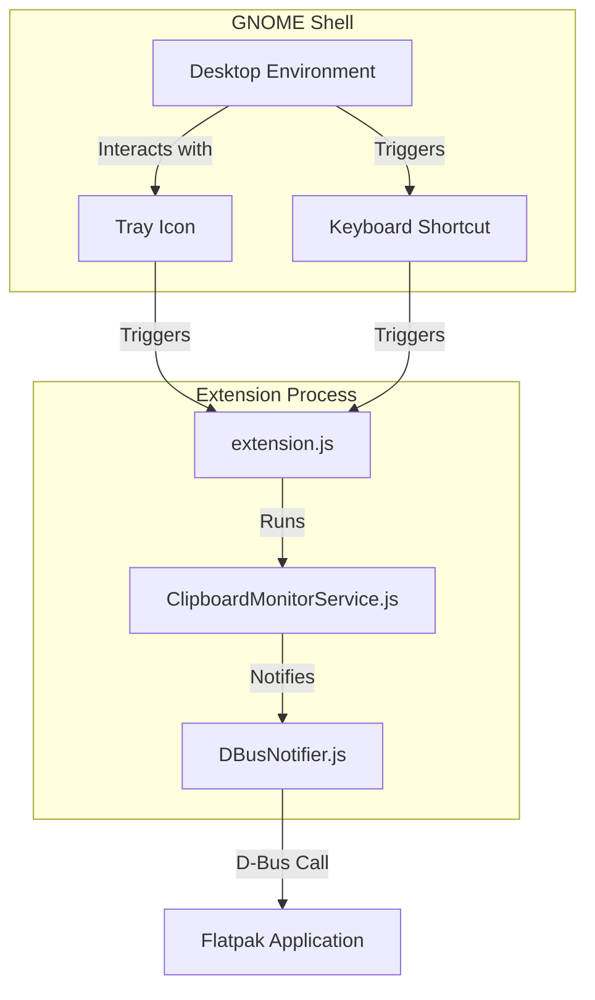
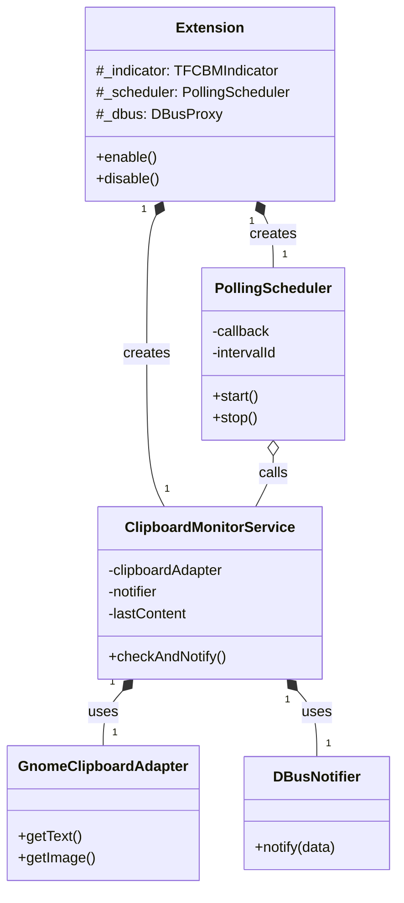

# TFCBM GNOME Shell Extension: A Deep Dive

This document provides a detailed architectural review of the TFCBM GNOME Shell Extension, covering its design, lifecycle, integration with the Flatpak application, and a breakdown of its internal components.

## 1. Overview & Purpose

The GNOME Shell Extension is a critical component that acts as the primary bridge between the user's desktop environment and the sandboxed TFCBM application. Its purpose is threefold:

1.  **Clipboard Monitoring**: To efficiently detect when the user copies new content to the clipboard.
2.  **UI Integration**: To provide a seamless user experience via a system tray icon for quick access and status indication.
3.  **Global Access**: To register a global keyboard shortcut that can activate the application from anywhere in the desktop environment.

It is written in JavaScript, as required for all GNOME Shell Extensions.



## 2. Lifecycle & Enablement

A key design choice in TFCBM is the **coupled lifecycle** between the main application and the extension. The extension is not meant to run standalone; its activity is tied directly to the application's state.

### Installation
The extension is bundled as a `.zip` file within the Flatpak at `/app/share/tfcbm/tfcbm-clipboard-monitor@github.com.zip`.

-   **First-Time Setup**: When the UI is launched and detects the extension is not installed, it presents a setup window guiding the user.
-   **Manual Installation**: The user can run `flatpak run io.github.dyslechtchitect.tfcbm tfcbm-install-extension` to install or reinstall it. This script uses `flatpak-spawn --host` to execute `gnome-extensions install` on the host system, effectively breaking out of the sandbox to perform the installation.

### Enablement & Disablement
The main TFCBM application is responsible for managing the extension's enabled state.
1.  **On App Startup**: When `ui/main.py` launches, it checks the extension's status. If it's installed but disabled, the UI calls `enable_extension()` (`ui/utils/extension_check.py`), which executes a D-Bus call to `org.gnome.Shell.Extensions` to programmatically enable it.
2.  **On App Quit**: When the user quits the application (e.g., via the right-click menu on the tray icon), the `Quit` method on the app's D-Bus service is called. This method, defined in `server/src/dbus_service.py`, makes another D-Bus call to `org.gnome.Shell.Extensions` to **disable** the extension.

This ensures the extension is only active when the application is meant to be running, preventing unnecessary background polling.

### Post-Uninstall Cleanup
The extension periodically checks if the TFCBM Flatpak is still installed (`flatpak list`). If it detects that the application has been uninstalled, it automatically disables itself to clean up the user's system.

## 3. Flatpak Integration: Bridging the Sandbox

Since the extension runs on the host system and the application runs inside a Flatpak sandbox, a robust communication bridge is essential. D-Bus serves as this bridge.

```mermaid
graph TD
    subgraph Host System (Extension)
        ExtensionJS[extension.js]
    end

    subgraph Flatpak Sandbox (Application)
        DBusService[TFCBMDBusService in ui/main.py]
    end

    ExtensionJS -- D-Bus Method Calls --> DBusService

    subgraph "D-Bus Method Calls"
        direction LR
        Activate
        ShowSettings
        Quit
        OnClipboardChange
    end

```

1.  **App to Extension**: The application controls the extension's lifecycle (enable/disable) by calling the standard `org.gnome.Shell.Extensions` D-Bus interface.

2.  **Extension to App**: The extension communicates with the app via a custom D-Bus service named `org.tfcbm.ClipboardService`, which is hosted by the UI process (`ui/main.py`).
    -   **Events**: When the clipboard changes, the extension calls `OnClipboardChange` with the new data.
    -   **Commands**: When the user interacts with the tray icon or keyboard shortcut, the extension calls `Activate`, `ShowSettings`, or `Quit` to control the UI.

3.  **App Presence Detection**: The extension needs to know if the app is running to determine if the tray icon should be visible. It achieves this by watching for the ownership of the D-Bus name `io.github.dyslechtchitect.tfcbm`. When the app starts, it claims this name on the bus; when it quits, it releases it. The extension listens for these `NameOwnerChanged` signals and updates the icon's visibility accordingly.

## 4. Code-level Breakdown (Units)

The extension's code is well-structured, following the principles of dependency injection and separation of concerns.



-   **`extension.js` (The Conductor)**: The main entry point.
    -   **`enable()`**: Initializes all components. It creates the `PollingScheduler` and the `ClipboardMonitorService`. It also creates the tray icon (`TFCBMIndicator`) and registers the global keyboard shortcut with `Main.wm.addKeybinding`.
    -   **`disable()`**: Cleans everything up, stopping the scheduler, removing the keybinding, and destroying the tray icon.
    -   **`_toggleUI()`, `_showSettings()`, `_quitApp()`**: These methods are triggered by user interaction and make the actual D-Bus calls to the Flatpak application using a `Gio.DBusProxy`.

-   **`src/PollingScheduler.js` (The Heartbeat)**: A simple class that wraps `GLib.timeout_add_seconds`. Its sole job is to call a provided callback function at a regular interval (e.g., every 250ms).

-   **`src/ClipboardMonitorService.js` (The Core Logic)**: This is the brain of the clipboard monitoring operation.
    -   It is initialized with two dependencies: a `clipboardAdapter` (to get data) and a `notifier` (to send data).
    -   The `checkAndNotify()` method is called by the `PollingScheduler`.
    -   It uses the `clipboardAdapter` to get the current clipboard content, compares it to the last known content, and if they differ, it calls the `notifier` to send the new data.

-   **`src/adapters/` (The Ports and Adapters)**: These classes implement the "how" of interacting with the outside world.
    -   **`GnomeClipboardAdapter.js`**: Implements the logic for getting data *from* the GNOME Shell clipboard API (`St.Clipboard`). It handles both text and image data.
    -   **`DBusNotifier.js`**: Implements the logic for sending data *to* the TFCBM application by calling the `OnClipboardChange` method on the `org.tfcbm.ClipboardService` D-Bus interface.

This modular, decoupled design makes the system easy to understand and test. Each unit has a single, clear responsibility.
