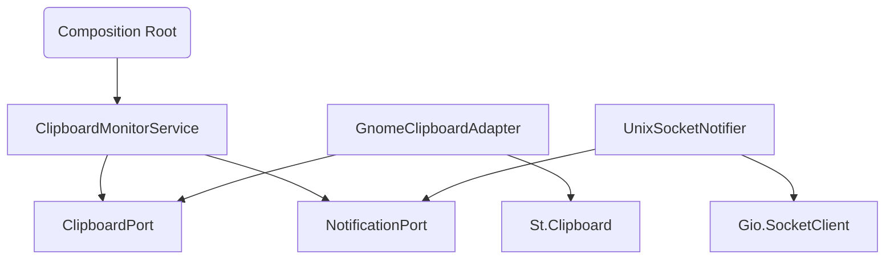

# GNOME Extension Refactoring & CI-Friendly Testing Plan

## 1. Introduction & Goals

This plan outlines a strategy to refactor the GNOME Shell extension for maintainability, readability, and testability, while keeping all automated tests fully CI-friendly.
Goals:

* Use **Test-Driven Development (TDD)** to drive design.
* Apply **SOLID principles** for a robust architecture.
* Achieve **100% unit and integration coverage** in CI.
* Avoid heavyweight dependencies (no nested GNOME Shell, VMs, or manual GUI steps).

---

## 2. Core Refactoring Strategy: Dependency Injection (DI)

* Identify service dependencies:

  * `ClipboardMonitorService` depends on a clipboard reader and notification sender.
* Invert control:

  * `extension.js` acts as the **composition root**, instantiating adapters and injecting them.
* Inject dependencies into services via constructor, using abstract "ports":

  * `ClipboardPort` → implemented by `GnomeClipboardAdapter`
  * `NotificationPort` → implemented by `UnixSocketNotifier`

---

## 3. Proposed Architecture (Post-Refactor)



**Notes:**

* GJS / GLib APIs (`St.Clipboard`, `Gio.SocketClient`) are **provided by the GNOME runtime**.
* Users do not need to install GLib or GJS manually.

---

## 4. Unit Testing Strategy (100% Coverage)

* Use **DI + mocks** for all dependencies.
* **Test Environment:**

  * GJS test runner (e.g., `gjs-mocha` or `gjs-jest`)
  * Mock loader for global `imports.gi` objects (`St`, `Gio`, `GLib`)
* **Component Testing Examples:**

  * `ClipboardMonitorService`

    * Inject `MockClipboardAdapter` and `MockNotifier`
    * Simulate clipboard change, assert `send()` is called with correct JSON
  * `GnomeClipboardAdapter`

    * Mock `St.Clipboard` methods
    * Assert calls propagate correctly
  * `UnixSocketNotifier`

    * Mock `Gio.SocketClient` and `Gio.UnixSocketAddress`
    * Assert JSON data is serialized and sent correctly
  * `PollingScheduler`

    * Mock `GLib.timeout_add`
    * Assert callback is registered and executes as expected

---

## 5. Integration-Like Testing (CI-Friendly Phase)

* **Goal:** Verify wiring of real components without launching GNOME Shell.
* **Method:**

  * Use real classes (`ClipboardMonitorService`, adapters) with **all low-level GJS/GLib primitives mocked**.
  * Simulate clipboard events programmatically and assert notifications sent.
* **Example:**

```javascript
const mockClipboard = new MockClipboard();
const mockSocket = new MockSocketClient();
const service = new ClipboardMonitorService(mockClipboard, mockSocket);

mockClipboard.simulateCopy("hello");
assert.deepEqual(mockSocket.lastMessage, { type: "text", content: "hello" });
```

* Fully CI-friendly; no X11, Wayland, or VM required.

---

## 6. E2E Testing (Manual Pre-Release)

* True clipboard + backend tests **cannot run in CI** reliably.
* Recommended workflow:

  1. Launch a nested GNOME Shell session or dedicated test machine.
  2. Run a mock Python server at the expected Unix socket.
  3. Programmatically set clipboard content (`wl-copy` / `xclip`).
  4. Assert correct JSON is received.
  5. Manual cleanup after tests.
* Use only **before release**; not part of automated CI.

---

## 7. CI Pipeline Strategy

* **Automated CI:**

  * Unit tests for all components
  * Integration-like tests (real classes + mocked GJS/GLib)
  * Coverage reporting (nyc/istanbul or c8)
* **Manual pre-release:**

  * Optional E2E test on local machine or VM
  * Validate real clipboard and backend integration

---

## 8. Step-by-Step CI-Friendly TDD Plan

### Setup & Tooling

* Configure GJS test runner and mock loader.
* Write initial failing unit tests to verify setup.

### Refactor Adapters

* Write mocks for `St.Clipboard` and `Gio.SocketClient`.
* Unit-test adapters for correct behavior.

### Refactor ClipboardMonitorService

* Inject mock ports.
* Write tests simulating clipboard changes and asserting notifications.

### Refactor extension.js

* Convert enable() into **composition root**.
* Wire real adapters for runtime execution.

### Integration-Like Tests

* Wire real classes together with mocks.
* Assert full flow from clipboard → service → notifier.

### CI Integration

* Include unit + integration-like tests in pipeline.
* Run linter and formatter (`eslint`, `prettier`) as part of CI.
* Optional: include E2E as manual test only.

---

## 9. Summary

* Fully CI-friendly testing achieved by mocking all GJS/GLib dependencies.
* Integration is simulated via DI and mocks; no heavyweight runtime required.
* Real E2E tests can be done manually for validation before release.
* Plan is practical, maintainable, and aligns with GNOME extension best practices.
