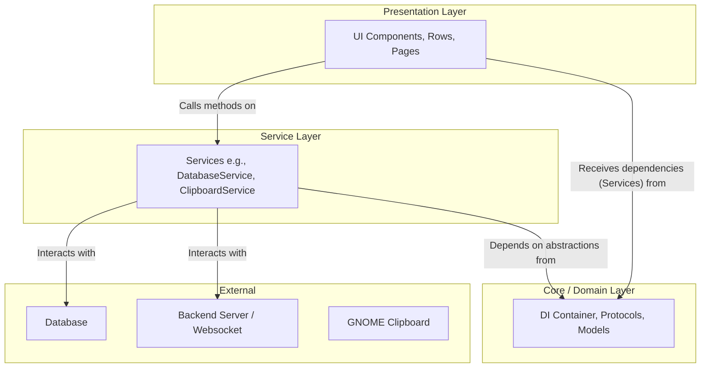
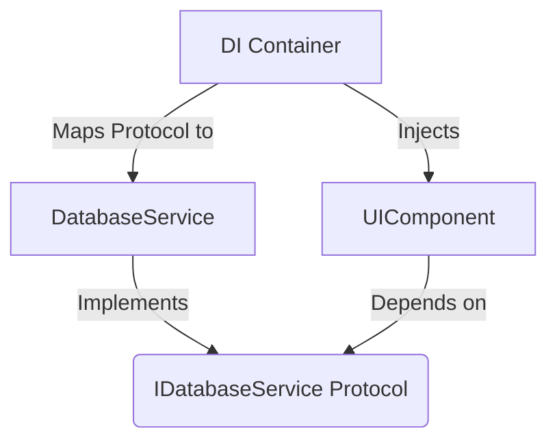
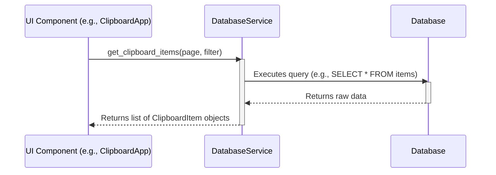
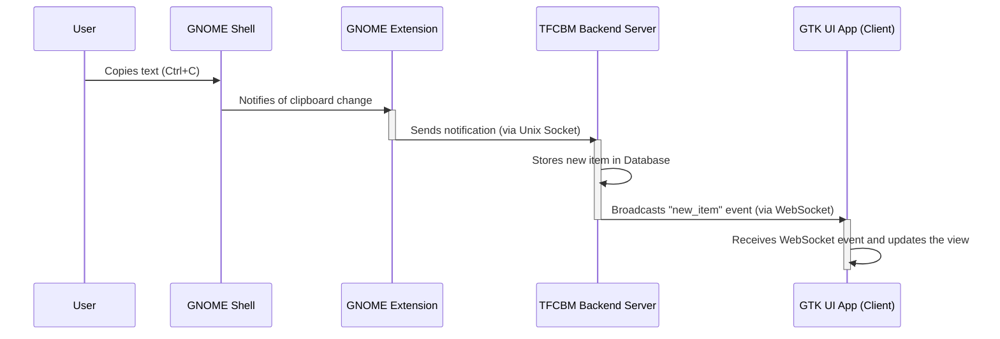

# TFCBM UI Architecture Overview

This document provides a high-level analysis of the refactored UI architecture for the TFCBM (The Fast Clipboard Manager) project. The goal is to illustrate how the different architectural layers interact, with a special focus on database access, clipboard integration, and real-time communication via websockets.

## 1. High-Level Architecture

The UI is built using a modern, layered architecture that separates concerns, making the application more maintainable, testable, and scalable. The core principles are **Dependency Injection (DI)** and a **Service-Oriented** approach.

The architecture is divided into three primary layers:

-   **Presentation Layer (`components`, `rows`, `pages`, `windows`):** This layer is responsible for everything the user sees. It's composed of GTK+ widgets and windows that display data and capture user input. It should contain no business logic.
-   **Service Layer (`services`):** This layer acts as a bridge between the Presentation layer and the application's core logic. It encapsulates business logic and coordinates access to data and external resources like databases or the clipboard backend.
-   **Core/Domain Layer (`core`, `models`):** This layer contains the fundamental building blocks of the application, including data models, interfaces (Protocols), and the Dependency Injection container itself.

## 2. Core Principles

### Dependency Injection (DI)

The application uses a Dependency Injection container (`ui/core/di_container.py`) to manage dependencies. This is the cornerstone of the architecture, ensuring that layers are decoupled.

-   **Protocols (`ui/core/protocols.py`):** Define the interfaces (contracts) for services.
-   **Services (`ui/services/`):** Provide concrete implementations of the protocols.
-   **UI Components:** Declare dependencies on the protocols, not on the concrete classes.
-   **DI Container:** Injects the concrete service implementations into the UI components at runtime.

This decoupling means a UI component doesn't care *how* data is fetched or stored; it only knows that it can call a method like `database_service.get_items()`.

## 3. Key Interaction Scenarios

This section details how the architectural layers work together to handle key application functions.

### 3.1. Displaying Clipboard Items (Database Access)

When the UI needs to display or search for clipboard items, it follows a clean, one-way data flow from the database to the UI, orchestrated by the service layer.

1.  A **UI Component** (like the main application window) needs to display items. It calls a method on the `DatabaseService` which was injected into it.
2.  The **DatabaseService** is responsible for creating a database query.
3.  The service executes the query against the **Database**.
4.  The service processes the raw database results, converting them into application-level data models.
5.  The service returns the list of data models to the UI component, which then renders them as widgets (e.g., `ClipboardItemRow`).

### 3.2. Real-time Clipboard Monitoring & UI Updates

A primary feature is automatically capturing clipboard changes. This is a more complex flow involving the GNOME Shell extension, the Python backend server, and the GTK UI client, all communicating to provide a seamless experience.

1.  **Clipboard Action:** The user copies text or an image.
2.  **GNOME Extension (`gnome-extension/`):** A JavaScript-based service (`ClipboardMonitorService.js`) running within GNOME Shell detects the change.
3.  **Unix Socket Notification:** The extension uses a Unix socket (`UnixSocketNotifier.js`) to send a lightweight notification to the Python backend server (`tfcbm_server.py`), indicating a new item is available.
4.  **Backend Server:** The Python backend receives the notification. It then uses its own logic to access the clipboard content, process it, and save it to the central database.
5.  **WebSocket Broadcast:** After successfully saving the new item, the backend server broadcasts a message (e.g., `{ "event": "new_item", "data": ... }`) over a WebSocket connection to all connected UI clients.
6.  **UI Update:** The GTK application, which maintains a persistent WebSocket connection to the backend server, receives the event. Its `ClipboardService` or equivalent handles the message and triggers a refresh of the UI, causing the new clipboard item to appear in the list in real-time.

## 4. Directory Structure Breakdown

The `ui/` directory is organized to support this layered architecture.

| Directory | Purpose |
| :--- | :--- |
| **`application/`** | Contains the main `Gtk.Application` class (`clipboard_app.py`), which orchestrates windows and application lifecycle. |
| **`components/`** | Holds reusable, self-contained GTK widgets (e.g., `SearchBar`, `ItemActions`). |
| **`config/`** | Manages application configuration, such as settings and important file paths. |
| **`core/`** | The architectural heart. Contains the **`di_container.py`** and interface definitions in **`protocols.py`**. |
| **`managers/`** | Manages complex UI-related logic that isn't tied to a single component, like pagination or window state. |
| **`models/`** | Defines the data structures used throughout the application. (Currently empty, may be defined in services/protocols). |
| **`pages/`** | Larger, more complex view containers, like a "Settings" page, composed of multiple smaller components. |
| **`rows/`** | Specialized `Gtk.ListBoxRow` widgets for displaying different types of data (e.g., `ClipboardItemRow`). |
| **`services/`** | Implements the application's business logic and data access (e.g., `DatabaseService`, `ClipboardService`). |
| **`utils/`** | Provides common, stateless helper functions (e.g., text formatting, icon loading). |
| **`windows/`** | Defines the main application windows (e.g., `MainWindow`, `AboutWindow`). |
